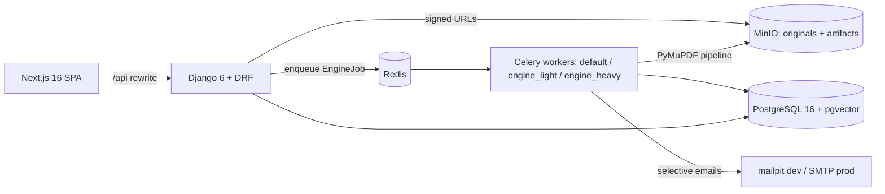

# Architecture — Versiona

> Memory Bank core file. Detailed design: `docs/plan/02-modelo-datos.md` (entities +
> invariants I1–I15), `docs/plan/03-backend.md` (apps, endpoints, roles),
> `docs/plan/04-frontend.md` (screens, state), `docs/plan/05-motor-comparacion.md`
> (engine pipeline + D5 algorithm).

## System shape

- **Bounded contexts** (each a Django app): core, accounts, orgs, projects, documents,
  reviews, observations, checks, comparisons, engine, notifications, billing, audit.
  Engine imports nothing from reviews/billing (extractable to a service later).
- **Conventions**: FBV `@api_view` + services layer; triple serializers; `public_id`
  (UUIDv7) in routes; non-members get 404 (I12); DRF pagination 25.
- **Immutability spine**: DocumentVersion frozen once analyzed (I2/I3); Seal +
  SealValidityRecord append-only (I4); seal validity = unbroken chain of `preserved`
  records (I11); D5 conservative bias (I7).
- **Runtime**: native processes on the VPS (no Docker — DP-21). PostgreSQL/Redis/MinIO/
  mailpit as system services; gunicorn+systemd at staging deploy time (deferred).

## Current workflow (updated per iteration)

**It0 (bootstrap) — DONE 2026-07-12**: services provisioned (Postgres 16 + pgvector via
template1, MinIO + `versiona-media` bucket, mailpit), Huey→Celery (static beat schedule),
MySQL→Postgres, FileSystem→S3-when-bucket-set, monolith split into bounded contexts
(auth preserved in `accounts`, StagingPhaseBanner in `core`), fresh 0001 migrations,
demo e-commerce purged on both sides, Versiona landing + `components/ui` kit,
deterministic PDF fixtures (`testdata/`), flow-definitions v2.0.0, CI on Postgres services.
Backend suite: 123 tests green; frontend: 114 tests green.

**Next — It1 (document core)**: models Org/Project/Document/Version/Section, native-text
analysis pipeline, jobs + polling endpoint, signed download, PdfViewer v1, timeline;
flows C1, C2, C3, B1 (`docs/plan/09` §3).
