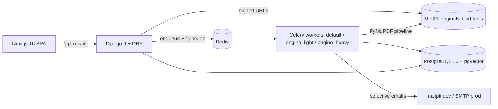

# Architecture — Versiona

> Memory Bank core file. Detailed design: `docs/plan/02-modelo-datos.md` (entities +
> invariants I1–I15), `docs/plan/03-backend.md` (apps, endpoints, roles),
> `docs/plan/04-frontend.md` (screens, state), `docs/plan/05-motor-comparacion.md`
> (engine pipeline + D5 algorithm).

## System shape

- **Bounded contexts** (each a Django app): core, accounts, orgs, projects, documents,
  reviews, observations, checks, comparisons, engine, notifications, billing, audit.
  Engine imports nothing from reviews/billing (extractable to a service later).
- **Conventions**: FBV `@api_view` + services layer; triple serializers; `public_id`
  (UUIDv7) in routes; non-members get 404 (I12); DRF pagination 25.
- **Immutability spine**: DocumentVersion frozen once analyzed (I2/I3); Seal +
  SealValidityRecord append-only (I4); seal validity = unbroken chain of `preserved`
  records (I11); D5 conservative bias (I7).
- **Runtime**: native processes on the VPS (no Docker — DP-21). PostgreSQL/Redis/MinIO/
  mailpit as system services; gunicorn+systemd at staging deploy time (deferred).

## Current workflow (updated per iteration)

**It0 (bootstrap) — DONE 2026-07-12**: services provisioned (Postgres 16 + pgvector via
template1, MinIO + `versiona-media` bucket, mailpit), Huey→Celery (static beat schedule),
MySQL→Postgres, FileSystem→S3-when-bucket-set, monolith split into bounded contexts
(auth preserved in `accounts`, StagingPhaseBanner in `core`), fresh 0001 migrations,
demo e-commerce purged on both sides, Versiona landing + `components/ui` kit,
deterministic PDF fixtures (`testdata/`), flow-definitions v2.0.0, CI on Postgres services.
Backend suite: 123 tests green; frontend: 114 tests green.

**It1–It8 — DONE 2026-07-12** (see `docs/audit/05-cierre.md`): document core (C1-C3,
B1), comparison engine + star screen (E1), Ed25519 seals + selective invalidation D5
(the jewel), collaborative review (D1-D3), mandatory OCR (ocrmypdf+tesseract-spa),
governance (B3/E3), onboarding wow + invitations + TOTP 2FA (A1-A3), monetization
limits + certificates + saved comparisons + org audit (F1-F3, E2, E4), hardening +
the 16-step master journey. 19 flows E2E green.

**It9 (freemium go-public prep) — DONE 2026-07-22**: `billing.Subscription` 14-day Pro
trial auto-started on signup with lazy `effective_plan` (console override > trial >
free) + daily notice beat; public catalog `GET /api/public/plans/`; new bounded-context
app `public_tools` for the anonymous comparator (`/api/public/comparisons/`, ephemeral
MinIO files, 24h TTL results, per-IP throttles, no OCR → upsell); frontend public
surfaces: landing revamp with dual CTA, /precios (live catalog + static fallback),
/comparar + shareable result page, TrialBanner, reusable UpgradeDialog on the three
402 sites; flow contract v2.2.0 (36 flows); CI green (OCR system deps, mailpit
service, quality-gate parser fixes).

**Next**: operator-gated go-public items — deployment (DP-21), domain+SMTP (DP-22),
Ed25519 key rotation/custody (DP-24), Wompi checkout keys (F1 payment leg), optional
It10: public certificate verification (/verificar + QR).
