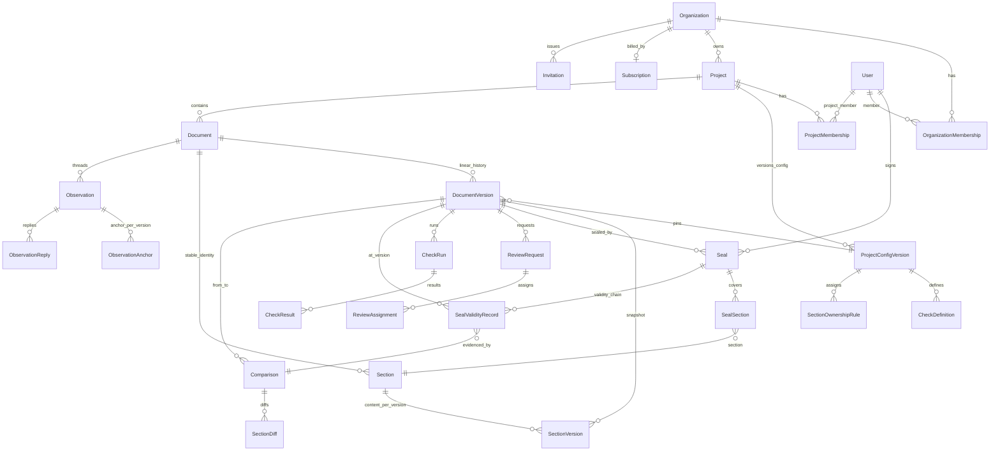

# 02 — Data Model

> Entities, attributes, relationships (ER diagram), the domain invariants written as
> enforceable rules, and the storage strategy (PostgreSQL for metadata, S3/MinIO for files).
> Names follow the glossary in `00-vision.md`. Flows referenced by id (A1…F1); invariants
> referenced from every other document as I1…I15.

## 1. Base reused

From the template: the custom `User` model (email login, `AUTH_USER_MODEL`) and
`PasswordCode` (reset-by-code) are kept under the new `accounts` app; `StagingPhaseBanner`
moves to `core`. Everything else in this document is new. The template's demo models
(Blog/Product/Sale) and the vendored `django_attachments` library are **removed** (image-
gallery oriented; PDF storage is a first-class domain service instead). Databases change
MySQL→PostgreSQL and file storage FileSystem→S3/MinIO per the fixed mission decisions.

## 2. Model conventions

- Internal PK (`BigAutoField`) + **`public_id` UUIDv7** (unique, indexed) exposed in every API
  route — prevents cross-tenant id enumeration.
- `created_at` / `updated_at` on all models (`core.TimestampedModel`).
- PostgreSQL-native types; `JSONB` where noted; `tsvector` for search; `vector` (pgvector) as
  a dormant column (DP-05).

## 3. Entities

### 3.1 Tenancy & access (A1, A2, F1)

| Model | Key fields | Constraints / notes |
|---|---|---|
| `Organization` | name, slug (unique), kind `personal\|team` | The personal workspace IS an org of one, auto-created at sign-up (A1). Billing subject (F1). |
| `OrganizationMembership` | role `owner\|admin\|member`, is_active | FK org, user. `unique(org, user)`. Service guard: ≥ 1 owner per org (A2). |
| `Invitation` | email, org_role?, project_role?, token (unique), status `pending\|accepted\|expired\|revoked`, expires_at | FK org, project (nullable), invited_by. `unique(org, email, project) WHERE status='pending'`. Seat limits checked at creation (I13). |
| `Plan` | code `free\|team\|enterprise`, price, currency, limits JSONB `{max_active_projects, max_members, history_days, max_file_mb}` | Free defaults: 1 project / 2 users / 30-day history access / 25 MB (F1, DP-04, DP-11). |
| `Subscription` | status `trialing\|active\|past_due\|canceled`, period_start/end, gateway, external_customer_id, external_subscription_id | FK org, plan. `unique(org) WHERE status IN (active, trialing)`. |
| `PaymentEvent` | gateway_event_id (unique per gateway), raw JSONB, invoice_pdf_key? | Append-only webhook ledger; idempotency by event id (F1). |

### 3.2 Projects & versioned configuration (B1, B2, B3)

| Model | Key fields | Constraints / notes |
|---|---|---|
| `Project` | name, slug, description, status `active\|archived(V2)`, is_sample (A1) | FK org. `unique(org, slug)`. Board state (in review / with observations / approved) is **derived**, not stored. |
| `ProjectMembership` | role `admin\|editor\|reviewer\|viewer` | FK project, user. `unique(project, user)` (A2). |
| `ProjectConfigVersion` | number (sequential), approval_policy JSONB (required seals / quorum), d5_mode `auto\|coordinator`, coordinators JSONB [user_ids] | FK project, created_by. `unique(project, number)`. **Immutable**: B3 edits create a new row — structural non-retroactivity (I8). |
| `CheckDefinition` | name, check_type `section_present\|field_required\|expected_value\|page_count_range`, params JSONB, severity `red\|yellow` | FK config_version (E3). Living inside the versioned config makes B3 non-retroactivity free. |
| `SectionOwnershipRule` | matcher (exact `stable_key` or glob over heading), required_for_approval bool | FK config_version, owner (user). Feeds D1 assignment and D5 notification. |

### 3.3 Documents, versions, sections (C1, C2, C3 — and the ground D5 stands on)

| Model | Key fields | Constraints / notes |
|---|---|---|
| `Document` | title, slug, approved_version FK (nullable — the single current one, I5), latest_number (cache) | FK project. `unique(project, slug)`. |
| `DocumentVersion` — **immutable** | number (sequential), message, sha256 (64 hex), file_key (S3), size_bytes, page_count, source_scenario `text_native\|scanned_ocr\|mixed`, ocr_confidence?, analysis_status `pending\|processing\|ready\|failed`, is_approved, approved_at?, **config_version FK (pinned at creation)** | FK document, author. `unique(document, number)` (I1); index `(document, sha256)` (duplicate rejection, edge F6). Content columns frozen by trigger (I2/I3). |
| `Section` — **stable identity** | stable_key (slug of normalized heading + disambiguator `-2`), title_current, level, created_in_version FK, retired_in_version FK? | FK document. `unique(document, stable_key)`. Identity does NOT depend on position (survives reordering) nor on the exact title (renames re-assign the SAME row via content matching, `05` §matching). This is the unit D5 operates on. |
| `SectionVersion` | heading_text, heading_hash, body_hash (sha256 of normalized text), normalized_text TEXT, search_vector tsvector (`spanish`, B2), embedding vector? (pgvector, **nullable, unpopulated in MVP**, DP-05), page_start/page_end, bboxes JSONB `[{page, x0, y0, x1, y1}]` (normalized 0–1, top-left origin), order_index, ocr_confidence?, char_count | FK section, document_version. `unique(section, document_version)`, `unique(document_version, order_index)`. GIN index on search_vector. |
| `SectionLineage` — append-only | relation `same\|renamed\|split_from\|merged_into\|added\|removed`, similarity float, decided_mode `auto\|coordinator` | FK from_section?, to_section?, document_version. The probatory evidence of every matching decision (D5). |

### 3.4 Review & approval (D1, D2, D4, D5)

| Model | Key fields | Constraints / notes |
|---|---|---|
| `ReviewRequest` | message, status `open\|completed\|cancelled\|superseded`, due_at? | FK document_version, requested_by (D1). |
| `ReviewAssignment` | scope JSONB `[section_ids]` or `"all"`, status `pending\|in_progress\|done` | FK review_request, reviewer. `unique(review_request, reviewer)` (D1/D2 inbox). |
| `Seal` — **append-only** | covers_all bool, signed_payload JSONB (canonical, see `08`), signature (Ed25519, b64), key_id | FK document_version, reviewer, review_request?. `unique(document_version, reviewer)` (one seal per reviewer per version). Covered sections via explicit M2M `SealSection(seal, section)`. Never updated, never deleted (I4). |
| `SealValidityRecord` — **append-only** | decision `preserved\|invalidated\|pending_confirmation\|superseded`, reason_code, evidence JSONB (verified hashes / changed sections + diff refs), proposed_decision?, decided_mode `auto\|coordinator`, decided_by?, decided_at | FK seal, to_document_version, comparison. `unique(seal, to_document_version)`. **A seal's validity at version N = an unbroken chain of `preserved` records from its signed version to N (I11).** The Seal row itself is never touched. |

### 3.5 Observations (D3)

| Model | Key fields | Constraints / notes |
|---|---|---|
| `Observation` | body, status `open\|answered\|resolved`, created_on_version FK | FK document, section? (logical anchor for re-anchoring), author. State machine in I14. |
| `ObservationAnchor` | page, quads JSONB (normalized), text_snippet (quote used to re-anchor), method `exact\|reanchored_section\|orphaned` | FK observation, document_version. `unique(observation, document_version)` — exactly one anchor per version, produced by the re-anchor job. |
| `ObservationReply` | body, status_change? | FK observation, author. |

### 3.6 Comparison & checks (E1, E3)

| Model | Key fields | Constraints / notes |
|---|---|---|
| `Comparison` | status, summary JSONB {counts, human summary}, triggered `auto\|manual` | FK document, from_version, to_version, created_by?. `unique(from_version, to_version)` = idempotency/cache (E1). |
| `SectionDiff` | change_type `unchanged\|modified\|added\|removed\|renamed_only\|split\|merged`, similarity, diff_artifact_key (S3) | FK comparison, section? (null when unmatched). |
| `CheckRun` | status, started_at/finished_at | FK document_version, config_version (the pinned one — I8). |
| `CheckResult` | outcome `pass\|warn\|fail` (green/yellow/red), evidence JSONB `{page, bbox, snippet, reason}`, message | FK check_run, check_definition. `unique(check_run, check_definition)` (E3). |

### 3.7 Platform (jobs, notifications, audit)

| Model | Key fields | Constraints / notes |
|---|---|---|
| `EngineJob` | job_type `analysis\|comparison\|seal_review\|reanchor\|check_run`, payload JSONB, result JSONB?, status `pending\|running\|done\|failed`, attempts, **idempotency_key (unique)**, celery_task_id, error_detail | FK document_version?. Index (job_type, status). Contract in `05` (I15). |
| `Notification` | notif_type, payload JSONB, read_at?, email_sent_at? | FK user, org. MVP: email + minimal in-app inbox (D1/D5 selective). |
| `AuditEvent` — **append-only** | event_type, object_type, object_id, payload JSONB, request_id, ip | FK org, project?, actor? (null = system). Denormalized ids, **no cascades** (survives deletions). Event catalog in `08`. Base for F3 (V2). |

## 4. ER diagram

## 5. Domain invariants (rules)

Each invariant states the rule, its enforcement mechanism, and the flow it protects. These are
the contract the unit-test suite in `06` asserts first.

| ID | Invariant | Enforcement | Protects |
|---|---|---|---|
| I1 | The history is linear: `version.number = max(number)+1` per document, no gaps, no parents; creation is serialized. | `unique(document, number)` + `select_for_update` on Document in the creation service; no parent field exists. Concurrency test. | C2, C3, D5 |
| I2 | A `DocumentVersion` with `analysis_status >= ready` admits no UPDATE of content fields (number, sha256, file_key, message, author, config_version) and no DELETE ever (MVP deletes nothing; C4 is V2). | Service-layer guard + **PostgreSQL trigger** rejecting UPDATE of frozen columns and DELETE + `save()` guard. Admin without delete. | Seals, C3 |
| I3 | A version with ≥ 1 seal admits no UPDATE/DELETE through any path (explicit superset of I2 for future C4). | PG trigger with EXISTS over Seal + test. | D4 |
| I4 | `Seal` and `SealValidityRecord` are append-only: never UPDATE (except the single `pending_confirmation → final` transition on the record) and never DELETE. | PG trigger + no mutation endpoints + read-only admin. "Withdraw my seal" (DP-08) = an append event, not a delete. | D4, D5, E4 |
| I5 | At most ONE current approved version per document. | Structural: single FK `Document.approved_version`; pointer moves leave an AuditEvent + historical `approved_at` per version. | D4 |
| I6 | Every seal is bound to (exact version, covered sections, reviewer) and its signature verifies against the canonical payload. | Ed25519 signature over canonical payload including version sha256 + section stable_keys+body_hashes + reviewer + timestamp (`08`). Verified at critical reads and at approval. | D4, E4 |
| I7 | **D5 conservative bias**: a seal is auto-PRESERVED only if ALL its covered sections have identical `body_hash` and equivalent heading; anything else (high-but-not-exact similarity, split/merge, ambiguous match, low OCR confidence) ⇒ INVALIDATE (auto mode) or `pending_confirmation` (coordinator mode). Never "preserve by default". | The default branch of the decision matrix is invalidate (`05` §4) + golden-case suite + property test: *no code path reaches `preserved` without hash equality*. | D5 (S4) |
| I8 | Config non-retroactivity: a version's checks, owners and approval rules are evaluated ONLY against the `config_version` pinned at its creation. | Structural (immutable FK, I2) + services never read "current config" to evaluate existing versions. | B3 |
| I9 | Hash integrity: sha256 computed server-side at upload completion, persisted, and re-verified before signing any seal and when issuing a download URL (against S3 metadata). Mismatch ⇒ version quarantined + AuditEvent + ops alert. | Ingest service + checks in `seal_service` and `download_service`. | C1, D4, E4 |
| I10 | Only the latest analyzed version (`analysis_status=ready` and `number = latest`) of a document can be sealed. | Guard in `seal_service` inside the same transaction with a document lock. | D4, I1 |
| I11 | A seal is valid at version N (> signed version) ⟺ a complete chain of `SealValidityRecord(preserved)` runs from the signed version to N. One `invalidated/superseded` link cuts the chain permanently. | Single domain function `seal_is_valid_at(seal, version)` used by approval, UI and D5 — no shortcuts. | D5, D4 |
| I12 | Multi-tenant isolation: every domain row is reachable from exactly one org, and every query goes through a membership filter. | Permission decorators + mandatory `scoped_queryset(user, org/project)` helpers (code review + per-endpoint tests). Non-members get 404, not 403. | All |
| I13 | Plan limits are checked at action time (create project, invite, upload) against `Subscription.plan.limits`. 30-day free retention is an ACCESS restriction, never deletion (DP-04). | Service guards (`enforce_limit(org, 'max_active_projects')`) + tests. | F1 |
| I14 | Observation states only transition `open → answered → resolved` (+ reopen `→ open`); threads are never deleted; each new version gets exactly one anchor (possibly `orphaned`). | State machine in service + `unique(observation, document_version)`. | D3 |
| I15 | No derived object (Comparison, CheckRun, SectionVersion) is recomputed with different effects: jobs are idempotent by natural key; re-running produces the same state. | `EngineJob.idempotency_key` unique + deterministic upserts (`05`). | C2, E1 |

## 6. Storage strategy

| Store | Holds | Details |
|---|---|---|
| **S3/MinIO** (private bucket, SSE, versioning ON; Object Lock in governance mode in production for sealed versions — reinforces I2/I4 at the object layer) | Original PDFs and engine artifacts | Key layout: `{env}/orgs/{org_uuid}/projects/{proj_uuid}/docs/{doc_uuid}/v{number}/original.pdf` · `.../v{n}/artifacts/sections.json` (raw engine output: words + positions) · `.../comparisons/{from}-{to}/diff-{section_key}.json` · `{env}/orgs/{org_uuid}/billing/invoices/{id}.pdf`. Keys are server-generated and **never overwritten** (one unique key per version). Access exclusively through signed URLs with short TTL (`08`). |
| **PostgreSQL** | The whole relational model + per-section normalized text (TEXT — MVP-scale documents fit comfortably) + `search_vector` tsvector (`spanish` config) | B2 content search = FTS over the `SectionVersion` rows of each document's latest version, joined through Document/Project with the membership filter (I12). |
| **pgvector** | `embedding` column on `SectionVersion` — **enabled but unpopulated in MVP** | Extension created in the initial migration (the compose image is `pgvector/pgvector:pg16`, `07`). Populated in V2 for semantic search and as an extra matching signal (DP-05). |

## 7. Open questions (DECISIÓN PENDIENTE)

| ID | Question | Recommendation |
|---|---|---|
| DP-04 | Free-plan 30-day retention vs the immutability promise. | **RESOLVED (operator, 2026-07-12): never delete** — versions older than 30 days become `locked` (visible in the timeline, not downloadable/comparable) and unlock on upgrade. Preserves I2/I3 and doubles as a conversion lever. |
| DP-05 | pgvector in MVP? | FTS `spanish` only in MVP; extension + nullable column ready from migration 0001; populate in V2. |
| DP-08 | "Withdraw my seal": forbidden, allowed pre-approval, or always? | Allowed only while the version is not approved, as an append-only `seal.revoked_by_reviewer` event (Seal never deleted, I4) + approval recompute + audit. Post-approval un-approval is a V2 admin flow. |
| DP-11 | Maximum PDF size / page count. | 100 MB / 500 pages on paid, 25 MB on free — stored in `Plan.limits` so it is adjustable without deploys. |
