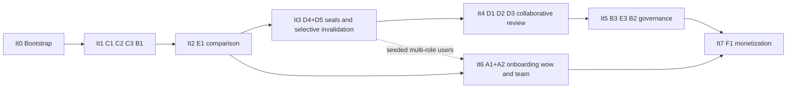

# 09 — Execution Roadmap

> Build order in **vertical iterations**: each iteration ships complete flow(s) working end to
> end (backend + frontend + tests at all three levels), never horizontal layers. D5 arrives as
> early as its dependencies allow, because it is the differentiator. Includes the Definition
> of Done per iteration and the consolidated register of pending decisions (DP-xx).

## 1. Base reused

The roadmap leans on fleet tooling already in the repo: `pre-staging-cleanup` skill (demo
purge), `new-project-setup` skill (template identity rewrite), `methodology-setup`
(Memory Bank instantiation — currently missing in the repo), `fake-data-refresh`, the CI and
quality gate (`07`), and the flow-coverage convention (`06` §5.3).

## 2. D5 critical path (why it lands in Iteration 3)

D5 operates on "sections that changed", which only exists once there are: **(a)** sections
indexed with stable identity → It1; **(b)** a comparison engine that classifies changes →
It2; **(c)** seals to invalidate → introduced together with D5 in It3. Everything not on that
path (observations, configurable checks, onboarding, billing) is deliberately queued behind
it. **D4 and D5 ship together**: a seal without an invalidation policy is design debt — it
would create sealed documents whose seals mean nothing on the next upload.

## 3. Iterations

| It | Flows (ids) | Backend / engine scope | Frontend scope | Required tests (from `06`) | Main risks |
|---|---|---|---|---|---|
| **0 — Bootstrap** (~1 week; the only horizontal one, and justified: without Postgres+Celery+MinIO no flow can be real end-to-end, and the demo e-commerce pollutes coverage, flow definitions and CI) | — | Huey→Celery (+beat with inherited tasks), MySQL/SQLite→PostgreSQL (+pgvector ext), FileSystemStorage→MinIO (django-storages), native provisioning of Postgres/Redis/MinIO/mailpit on the dev VPS (`07` §2.1 — **Docker deferred per DP-21**), new app skeleton (`03` §2), `testdata/generate_pdfs.py` + committed fixtures (`06` §6) | Demo purge (pages/stores/specs — `pre-staging-cleanup`), project identity (`new-project-setup`: CLAUDE.md/README/AGENTS.md say Versiona), Memory Bank instantiation (`methodology-setup`), base layout + minimal `components/ui` kit (Modal/Toast/Tabs/StatusBadge/EmptyState) | CI green after adaptation (`07` §3), `flow-definitions.json` v2.0.0 with the 20 flows in `missing`, smoke E2E (sign-in + landing) | Storage/queue swap breaks admin SSO handoff — mitigated by the smoke suite |
| **1 — Document core**: C1, C2, C3, B1 (+B2 minimal: unfiltered list) | Models Org/Project/Document/Version/Section (pinned config included); analysis pipeline for native text (no OCR yet); EngineJob + polling endpoint; signed download; hardcoded default checklist (basic traffic light for C1) | `/projects`, `/projects/new`, project view, timeline, UploadDropzone + jobStore, PdfViewer v1 (render + sections), E2E storageState setup | Unit: immutability (I1–I3), analysis, matching v0; integration: full role matrix on every new endpoint; E2E: `b1`, `c1`, `c2`, `c3` | Section indexing is THE technical bet — validated against all 4 edge fixtures from day one |
| **2 — Comparison (star)**: E1 | Section diff engine + highlight bboxes + per-pair cache + summary (`05` §4–5) | CompareView (3 views), SyncScrollController, SectionChangeList, ChangeSummary, DiffHighlight overlays | Unit: comparison_service vs the truth table; pure sync/coords; E2E: `e1` with exact assertions | Scroll-sync UX; mitigated by section-based (not pixel) sync + an early internal demo |
| **3 — Seals + D5 (the jewel)** 💎: D4, D5 | Seal/SealSection/SealValidityRecord; pure `invalidation_service` (95% gate); auto/coordinator modes; freezing (I5); selective email (only affected reviewers); multi-role users via seed (A2 UI not needed yet) | SealsPanel (validity states + records), SealActionBar, InvalidationReviewCard (coordinator), PostUploadSummary with affected seals, inbox v1 (re-reviews) | Unit: **invalidation_service parametrized + property test (I7)**; integration: seals + confirm matrix; E2E: `d4` and the **queen `d5`** (multi-context) | The queen E2E is flake-prone: API-driven setup, mailpit API, CI retries=2, per-document job serialization |
| **4 — Collaborative review**: D1, D2, D3 | ReviewRequest/Assignment, "already reviewed by you" progress service, anchored observations + re-anchor job, owner-based reviewer suggestion (simple owners) | ReviewRequestPanel, full inbox, ReviewContextBar, ObservationsPanel + RegionSelector | Unit FE: region/thread; unit BE: progress + re-anchor; E2E: `d1`, `d2`, `d3`; a11y smoke (`@axe-core/playwright`, DP-18) | Anchor precision under zoom — covered by `coords.test` + E2E with a known bbox |
| **5 — Project governance**: B3, E3, B2 complete | Configurable checklist with evidence, section-owners UI backing, approval rules, content search (PostgreSQL FTS `spanish`), derived project states | Full settings (B3), ChecksPanel with evidence links, board filters/search | Unit: check_engine (incl. non-retroactivity I8); E2E: `b3`, `e3`, `b2` | FTS in Spanish (config `spanish`) — validated with fixture content |
| **6 — Onboarding wow + team**: A1, A2 | sample-project seed job (reuses `testdata/pdfs`), invitations with tokens, onboarding progress persistence | OnboardingWizard (4 steps), `/invite/[token]`, MembersTable/InviteForm, < 5 min metric instrumentation (S1) | E2E: `a1` (fresh guest, no storageState) and `a2` (mailpit); unit: seed service, membership model | A1's wow depends on a polished E1 — that is why it comes after; basic template auth covers access from It1 |
| **7 — Monetization + hardening**: F1 | Plan limits (free: 1 active project / 2 users / 30-day access — I13, DP-04), gateway integration behind the `PaymentGateway` adapter (DP-01), webhook, invoices | BillingPanel, UsageMeter, limit modals, self-service upgrade | Unit: billing_limits; E2E: `f1` (gateway test mode); raise Jest gate to 60 (`06` §8) | External gateway dependency (DP-01 must be decided before this iteration); webhooks need a tunnel in dev |

**Post-It7**: OCR for scanned documents was scheduled inside It4–It5 as a sub-delivery if
capacity allows (DP-02 engine, `worker-heavy` queue, degraded-mode UX per `05` §3); otherwise
it becomes It8 before launch — it is MVP scope (C1 accepts scans) and must not slip past the
public cut (see DP-14).

## 4. Definition of Done (every iteration)

1. Code merged into the feature branch through a reviewed PR (fleet git protocol: one active
   feature branch, commits identify the work).
2. Tests green in CI at the **three levels** (pytest, Jest, Playwright) for the iteration's
   flows, per the `06` traceability matrix.
3. Coverage does not drop below the thresholds in force (`06` §8); the PR's coverage-summary
   comment evidences it.
4. `e2e/flow-definitions.json` marks the iteration's flows `covered`;
   `docs/USER_FLOW_MAP.md` updated with their sheets.
5. Migrations apply clean from zero (`migrate` on empty Postgres) + `makemigrations --check`
   passes.
6. `create_fake_data`/`delete_fake_data` cover the new models (scenarios stay coherent).
7. No hardcoded secrets; base security checklist (`08` §1) passes.
8. A live/recorded demo of the flow end to end on the dev/staging environment (`07` §2.1).
9. No template residue in the touched screens/modules.

## 5. Consolidated pending-decision register

Full statements live in the owning documents; this is the master index.

| ID | Topic | Owning doc | Status / Recommendation |
|---|---|---|---|
| DP-01 | Payment gateway (LATAM) | `03` | **RESOLVED (operator, 2026-07-12): Wompi** behind the `PaymentGateway` adapter |
| DP-02 | OCR engine | `05` | ocrmypdf + Tesseract (spa) |
| DP-03 | Default `d5_mode` | `05`/`01` | **RESOLVED (operator, 2026-07-12): auto** (only preserves on exact hash equality; coordinator opt-in; forced on degraded/low-OCR) |
| DP-04 | Free-plan 30-day retention vs immutability | `02` | **RESOLVED (operator, 2026-07-12): lock access, never delete** |
| DP-05 | pgvector in MVP | `02` | FTS only; column ready, populate V2 |
| DP-06 | Upload presigned vs multipart | `03` | Presigned PUT + authoritative complete |
| DP-07 | Coordinator: role vs capability | `03` | Capability `can_confirm_seal_plan` |
| DP-08 | Withdraw my seal | `02` | Pre-approval only, append-only event |
| DP-09 | No-headings fallback | `05` | Section-per-page + degraded mode + coordinator |
| DP-10 | Strict vs additive config non-retroactivity | `05` | Strict in MVP |
| DP-11 | Max PDF size/pages | `02`/`08` | 100 MB/500 p paid, 25 MB free |
| DP-12 | Antivirus in pipeline | `08` | Defer to pre-GA |
| DP-13 | 19 vs 23 flows (prompt vs artifact) | `01` | Artifact governs |
| DP-14 | Launch cut: Etapa 1 vs full 16-flow MVP | `01` | **RESOLVED (operator, 2026-07-12): full MVP is the public cut**; Etapa 1 is internal |
| DP-15 | Flat routes vs org slug | `04` | Flat in MVP |
| DP-16 | Page virtualization | `04` | Own IntersectionObserver |
| DP-17 | i18n | `04` | Spanish-only MVP with TS dictionaries |
| DP-18 | Viewer accessibility depth | `04` | Text layer + keyboard nav + axe smoke (It4) |
| DP-19 | E2E in CI: services vs compose | `06`/`07` | Native services |
| DP-20 | Jest threshold jump | `06` | Progressive 50→55→60 |
| DP-21 | Staging runtime | `07` | **RESOLVED (operator, 2026-07-12): no Docker for now** — native fleet runtime (gunicorn/systemd, native Postgres/Redis/MinIO); deployment polish deferred post-MVP |
| DP-22 | Domain + production SMTP | `07` | Operator call (deferred with deployment, DP-21) |
| DP-23 | VPS sizing for OCR | `07` | Measure in It4/It5 |
| DP-24 | Ed25519 key home in production | `08` | Secret manager before first regulated customer |

**The former top-5 blockers (DP-01, DP-14, DP-03, DP-04, DP-21) were all answered by the
operator on 2026-07-12** — execution is unblocked. Remaining recommendations stand unless
contradicted during implementation.

## 6. Open questions (DECISIÓN PENDIENTE)

The register above (§5) IS this document's open-questions section; no additional items.
